# User flows

Each journey as a Mermaid diagram. Route names come from `NAVIGATION.md`.
Rules that apply to all flows are at the end.

## 1. First launch (the questionnaire)

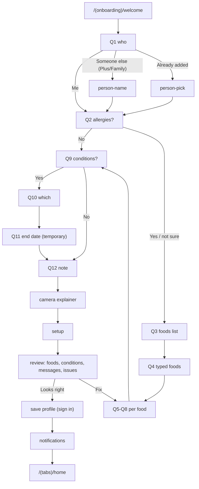

## 2. Returning user

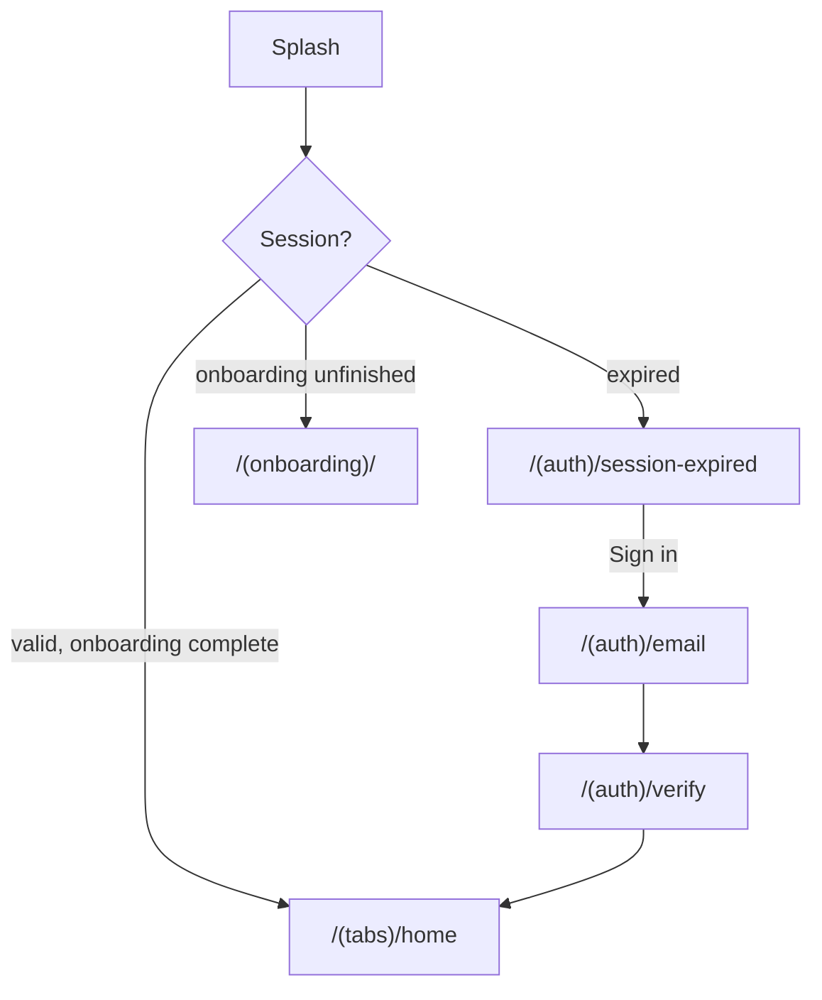

## 3. Scan

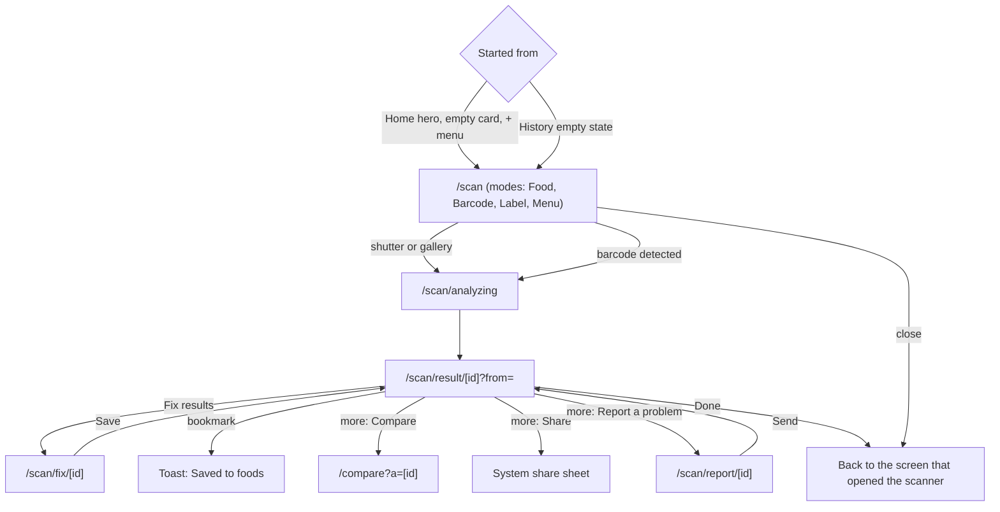

## 4. Barcode not found and blurry photo

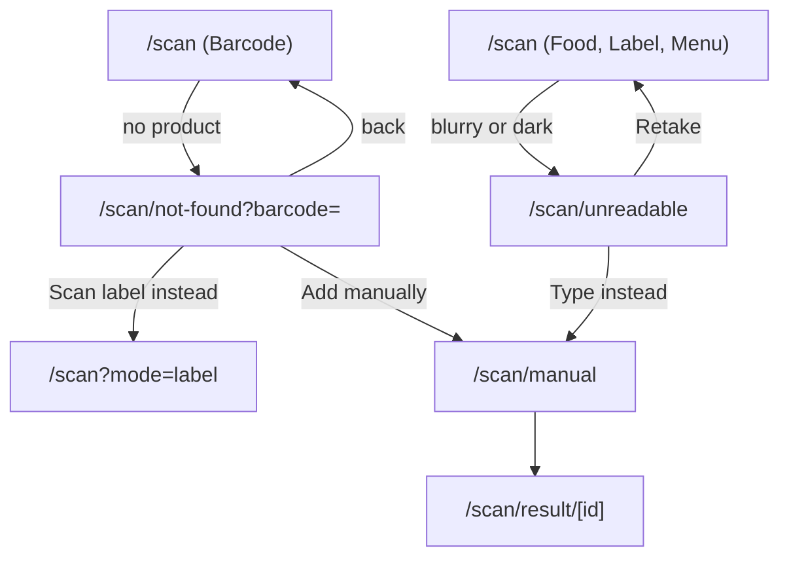

## 5. Search, product, save, compare

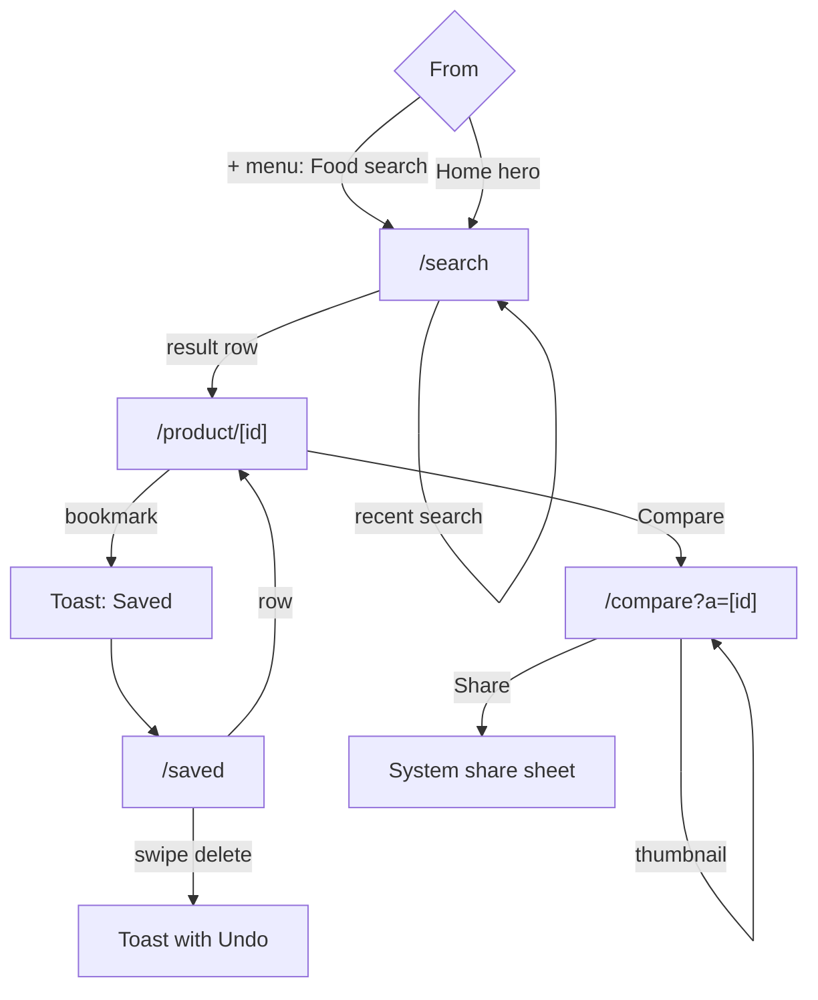

## 6. Log a reaction

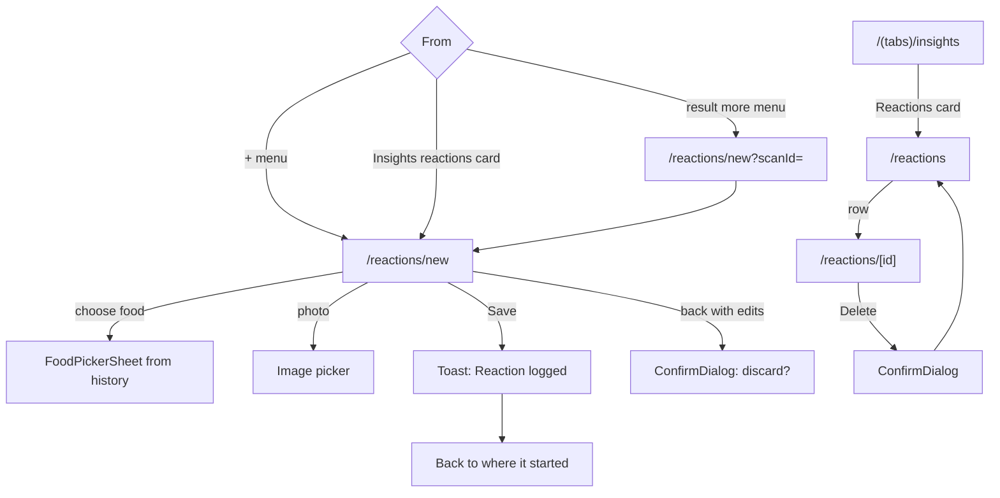

## 7. Groups and family

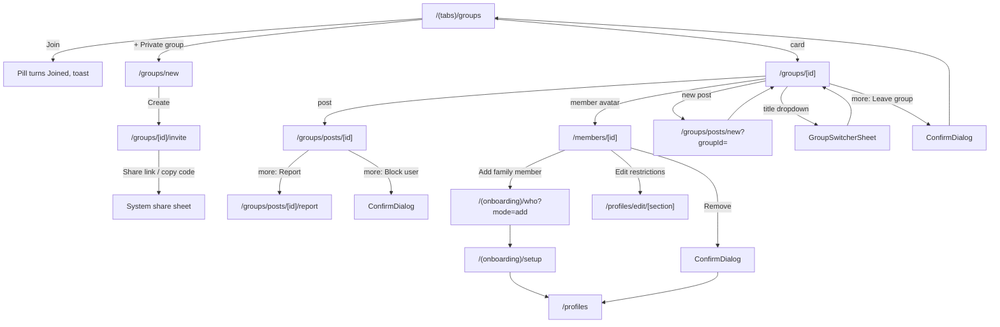

## 8. Edit restrictions and see results update

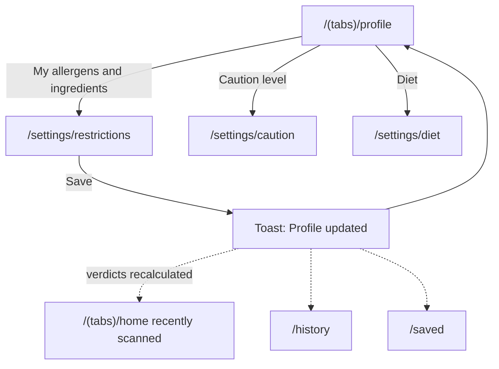

## 9. Notifications

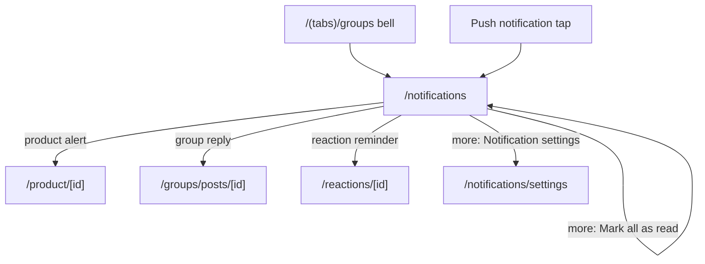

## 10. Logout and delete account

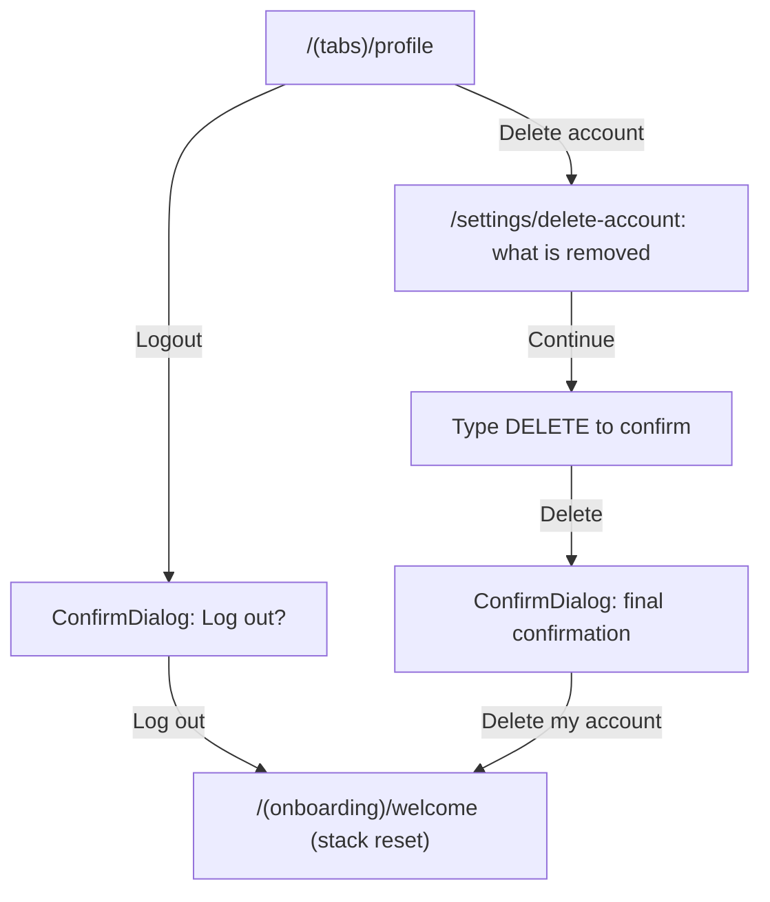

## 11. Log food, water and exercise (Phase 3)

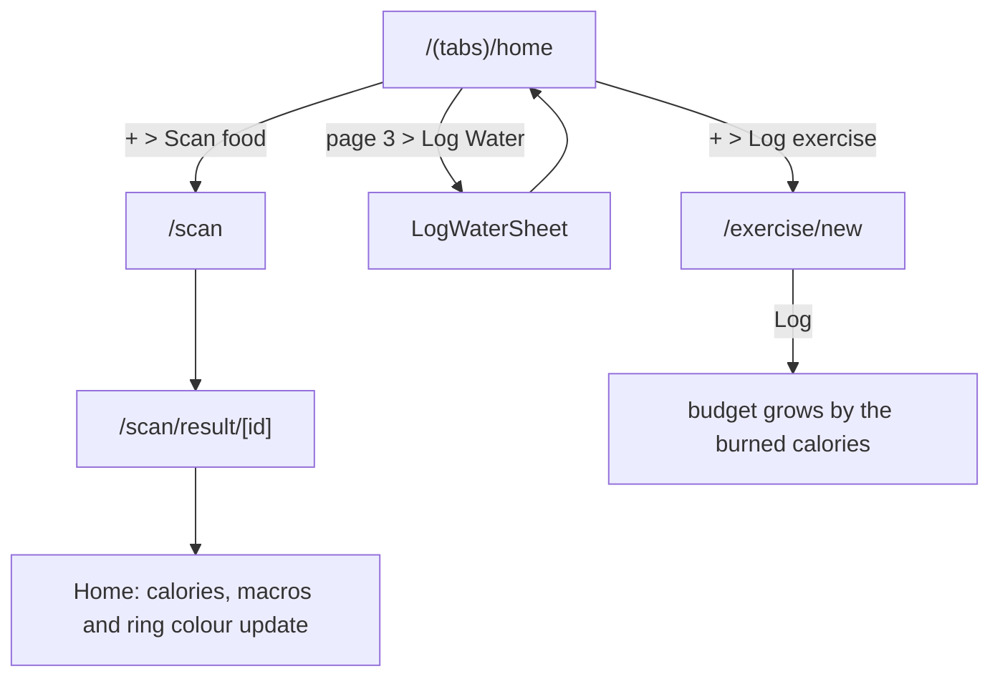

## 12. Connect Apple Health

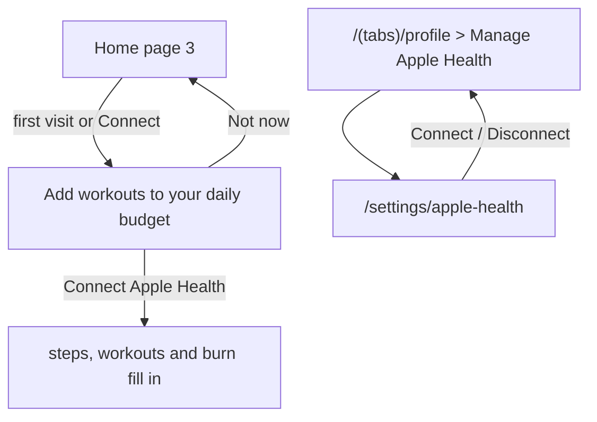

## 13. Weight, goals and milestones

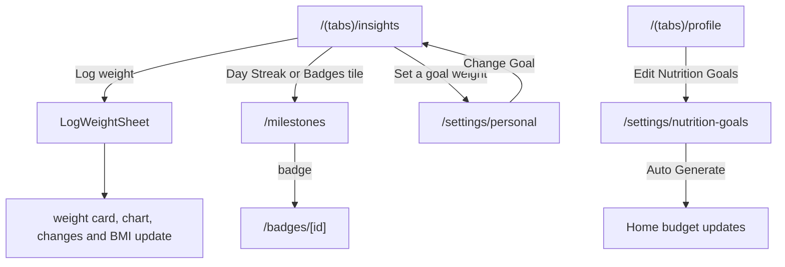

## Rules for every flow

- Every screen has a clear way in and out; there are no dead ends.
- Back returns to the previous screen with its scroll position and selections kept. Android hardware back does the same.
- Closing the scanner, a sheet or a result returns to the screen that opened it (`?from=`), not always Home.
- Finishing a task (save, log reaction, join group) shows a toast and returns the user to a sensible place.
- Once Home is reached the onboarding stack is replaced, so back cannot re-enter onboarding.
- Screens with unsaved changes ask before leaving.
- Route names are deep link ready so notifications can open the right screen later.
